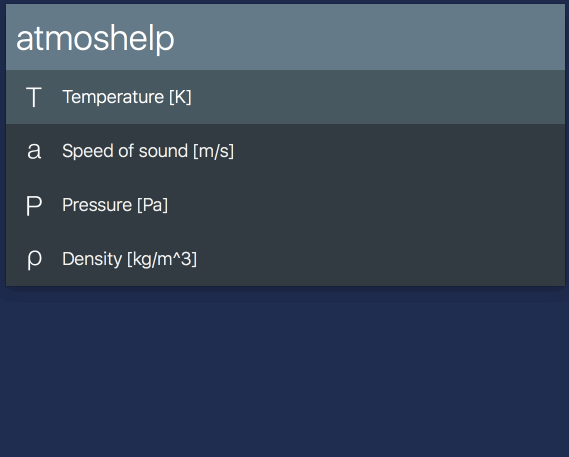

# Atmos #

An Alfred workflow to find temperature, speed of sound, pressure, and density at queried altitude,
acording on International Standard Atmosphere model.

Basically a python port of Matlab's [atmosisa][atm].

## Usage ##

- `atmos <query>` — Show values for altitude <query>. Defaults to meters, but if query ends in `f` or `ft`, the proper conversion is made.
    - `↩` or `⌘+<NUM>` — Copy result to clipboard

## Demo ##

## Licencing, thanks ##

This workflow is released under the [MIT licence][mit].

This workflow uses the [Alfred-Workflow][aw] library, which is also released under the [MIT licence][mit].

## Changelog ##

### 1.0.1 ###

- First release

[mit]: ./src/LICENCE.txt
[aw]: http://www.deanishe.net/alfred-workflow/
[atm]: http://www.mathworks.com/help/aerotbx/ug/atmosisa.html
